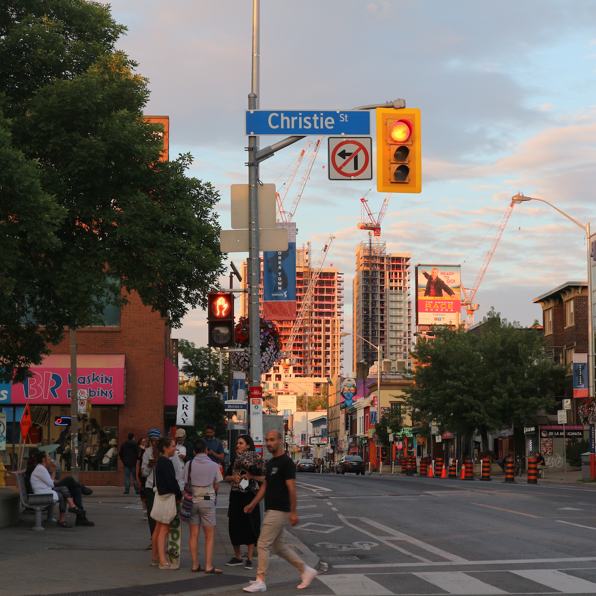

## About
I am a Ph.D. Candidate in the Department of City and Regional Planning at University of California, Berkeley, studying urban planning and housing policy. Please refer to my 💡[**Curriculum Vitae**](https://taesoosong.github.io/academic_cv/song_taesoo_cv.pdf) for more information.

My current affiliations include:
- Graduate Student Researcher, [Terner Center for Housing Innovation](https://ternercenter.berkeley.edu/)
- Graduate Fellow, [UC Berkeley Asian American Studies Research Center](https://issi.berkeley.edu/aarc)
- Data Science Fellow, [UC Berkeley D-lab](https://dlab.berkeley.edu/)

I have also worked as a Graduate Student Researcher at the [Urban Displacement Project](https://www.urbandisplacement.org/). Prior to my doctoral program, I was a researcher at the [Seoul Institute](https://global.si.re.kr/), studying commercial gentrification and urban industries in downtown Seoul.

  
   
   
   

## Research Areas
I have two sets of closely related research areas.

First, I study the nexus between **local housing policies, neighborhood change, and residential outcomes of low-income and minority households**, particularly in high-cost metropolitan areas. My recent and ongoing projects have explored:
- How gentrification impacts housing choices of low-income households in the New York and San Francisco metropolitan areas (published in [_Urban Studies_](https://doi.org/10.1177/00420980241244699), co-authored with Karen Chapple)
- How housing construction impacts displacement and exclusion of low- and moderate-income households in Los Angeles and San Francisco (published in [_Journal of American Planning Association_](https://doi.org/10.1080/01944363.2024.2319293), co-authored with Karen Chapple)
- How novel big data sources can help us better study household residential mobility (accepted for publication in _Cityscape_, co-authored with Alex Ramiller, Madeleine Parker, and Karen Chapple)
- Whether there are increasing investor purchases of naturally occurring affordable housing (NOAH) stocks in California and how they might relate to neighborhood change and renter displacement (co-authored with Carolina Reid)
- Whether upzonings in New York City resulted in the displacement of low-income renters (co-authored with Jenna Davis, Karen Chapple)

Second, I am also deeply interested in the profound demographic shift towards **greater ethnic diversity in American and Canadian cities** with a focus on Asian populations. This growing trend requires an updated understanding of how policy and planning impact patterns of housing access and segregation beyond the white-black binary paradigm. Recent projects that examine this issue include:
- How provincial foreign buyer taxes, in response to international capital inflows into housing markets, impact rental market affordability in British Columbia and Ontario in Canada (submitted to a journal)

## Dissertation
My dissertation research seeks to **reassess the prevailing narrative that Asian Americans encounter minimal barriers in the housing market**. Specifically, I hypothesize that Asian Americans face both conventional resource-based housing constraints and distinct forms of housing discrimination, which could potentially be underestimated when their vast internal diversity and unique experiences of racism are disregarded in research.
