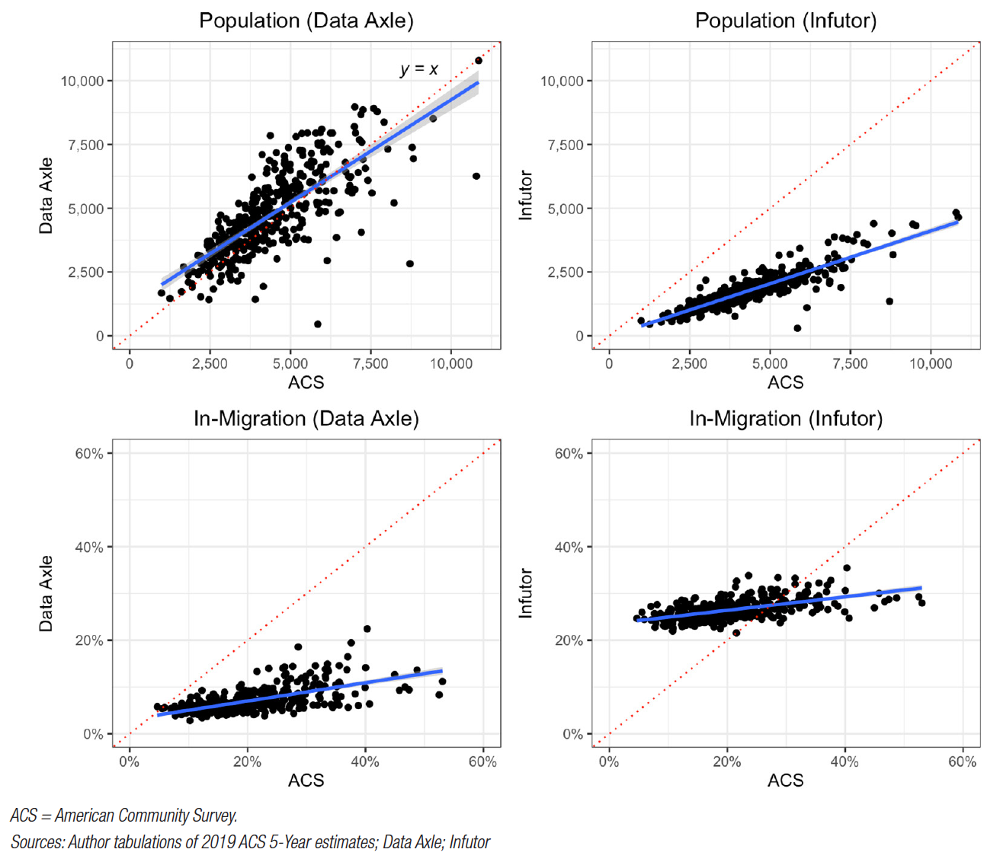
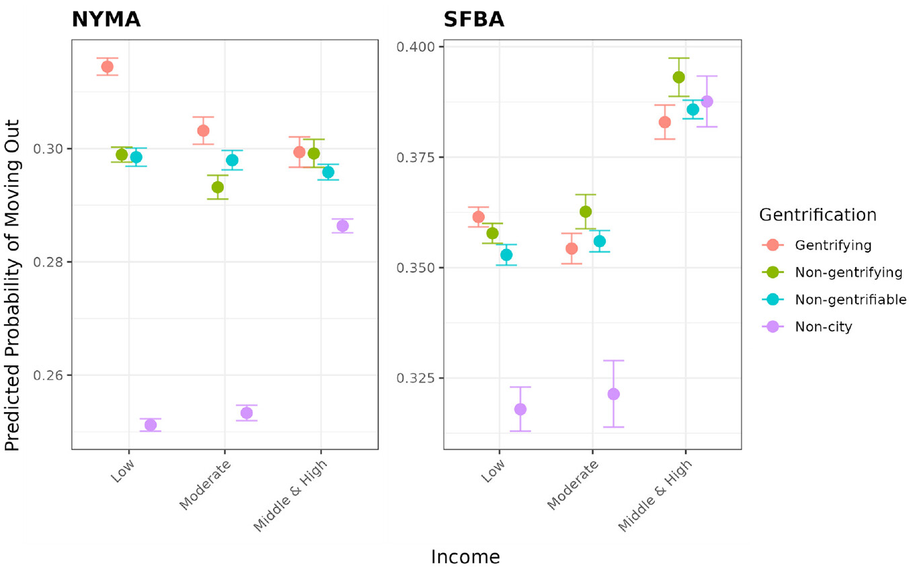
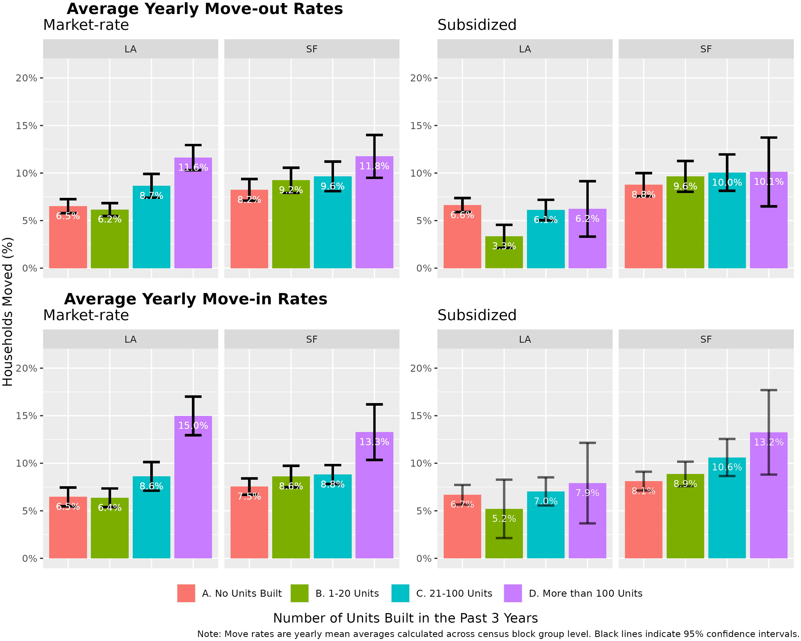
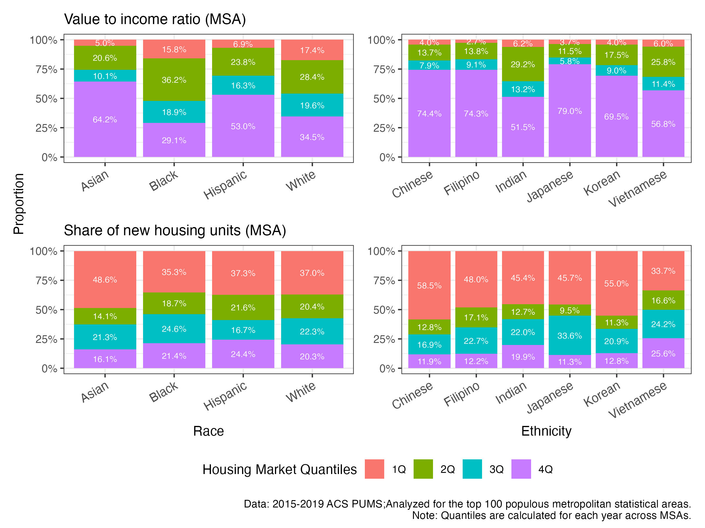

  

    You can also find my published research on 
    <a href="https://scholar.google.com/citations?user=xM5Rc-EAAAAJ&hl=en">my Google Scholar profile</a>.
  

## 1. How Does Housing Policy Shpae Residential Mobility and Neighborhood Access?

I study the nexus between **local housing policies, neighborhood change, and residential outcomes of low-income and minority households**, particularly in high-cost metropolitan areas. I'm particularly interested in leveraging novel big data sources and quantitative methods to study these dynamics, which traditional survey data may have not fully captured.

#### [2024] Residential Mobility and Big Data: Assessing the Validity of Consumer Reference Datasets (_Cityscape_, co-authored with Alex Ramiller, Madeleine Parker, and Karen Chapple)

  

    
  

#### [2024] Does gentrification constrain housing markets for low-income households? Evidence from household residential mobility in the New York and San Francisco metropolitan areas ([_Urban Studies_](https://doi.org/10.1177/00420980241244699), co-authored with Karen Chapple)

  

    
  

####  [2024] Can New Housing Supply Mitigate Displacement and Exclusion? Evidence from Los Angeles and San Francisco ([_Journal of American Planning Association_](https://doi.org/10.1080/01944363.2024.2319293), co-authored with Karen Chapple)

  

    
  

My ongoing projects are examining:

- Whether there are increasing investor purchases of naturally occurring affordable housing (NOAH) stocks in California and how they might relate to neighborhood change and renter displacement (co-authored with Carolina Reid)

- Whether upzonings in New York City resulted in the displacement of low-income renters (co-authored with Jenna Davis, Karen Chapple)

## 2. How Is Immigration Changing American Cities and Housing Landscapes?

I am also deeply interested in the profound demographic shift towards **greater ethnic diversity in American and Canadian cities** with a focus on Asian populations. This growing trend requires an updated understanding of how policy and planning impact patterns of housing access and segregation beyond the white-black binary paradigm.

- How provincial foreign buyer taxes, in response to international capital inflows into housing markets, impact rental market affordability in British Columbia and Ontario in Canada (submitted to a journal)

## 3. Dissertation: Reassessing Asian American Exceptionalism in Housing

  

    
  

  

    
  

