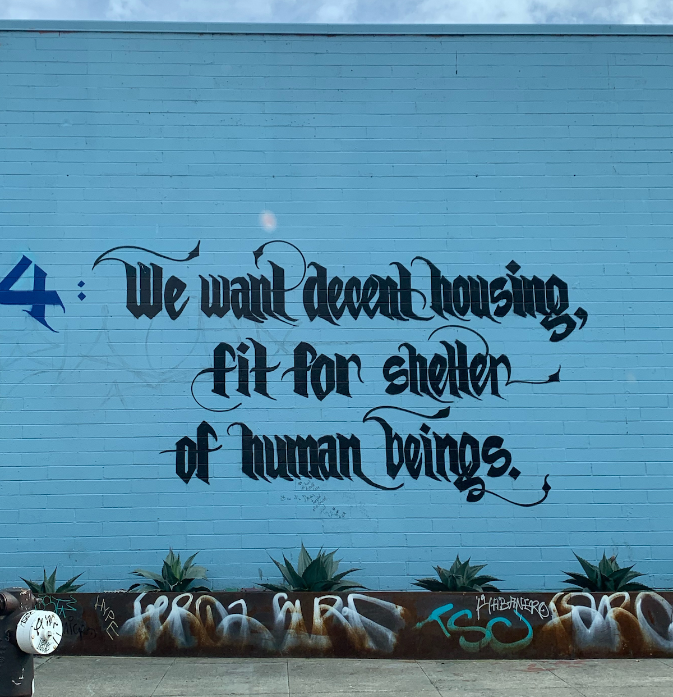
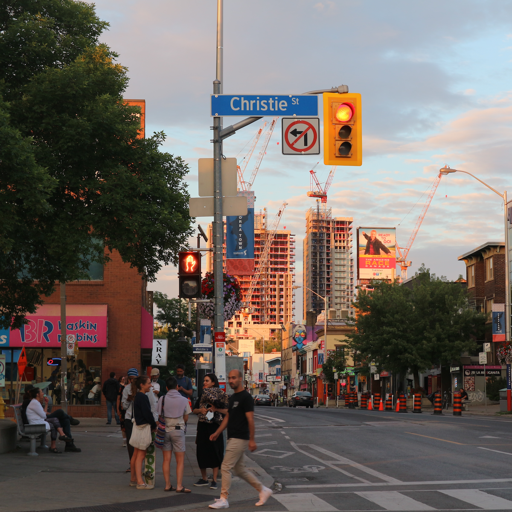
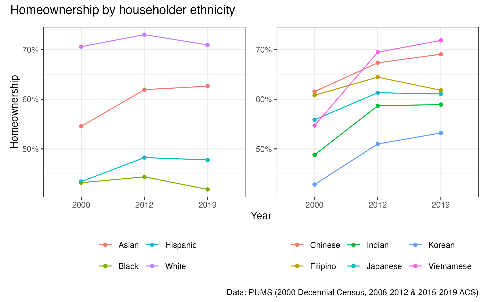

  

    My research broadly lies at the intersection of housing and land use policy, residential mobility, race/ethnicity and segregation, and immigration. I primarily use quantitative and geospatial methods to investigate these topics, complemented by qualitative insights from interviews and discourse analysis. You can find my published research on  <a href="https://scholar.google.com/citations?user=xM5Rc-EAAAAJ&hl=en">my Google Scholar profile</a>.
  

## Land Use and Housing Policy Residential Mobility

I study how **policy contexts impact residential mobility and broader geographies of opportunity and segregation**, particularly in high-cost metropolitan areas. My research leverages **novel big data sources and quantitative, geospatial methods** to study these dynamics, informing theory and policy.

### Zoning and Housing Supply Policies

Planners, policymakers, and advocates increasingly look to zoning reforms and other supply-side strategies to improve housing affordability, but these efforts often raise concerns about potential residential displacement and reduced access for low-income households. Yet such debates frequently oversimplify the complexities of policy design—overlooking questions about the appropriate intensity of upzoning or the types of housing suited to different neighborhoods. My research addresses the equity impacts of zoning and housing supply policies by using fine-grained residential mobility patterns to examine these dynamics.

- Chapple, K. & **Song, T.** ["Can New Housing Supply Mitigate Displacement and Exclusion? Evidence from Los Angeles and San Francisco."](https://doi.org/10.1080/01944363.2024.2319293) _Journal of the American Planning Association 91_(1), 1-15.
  - Blog Post ([_Housing Matters_](https://housingmatters.urban.org/research-summary/does-new-housing-supply-affect-displacement) at Urban Institute)
  - Video Explainer ([_Urban Displacement Project_](https://www.youtube.com/watch?v=dsWAfFNVPTY))
- Davis, J., **Song, T.** & Chapple, K. "How Does Upzoning Impact Residential Mobility Among Low-Income Households? Evidence from New York City."

### Gentrification and Neighborhood Change

For decades, scholars have debated how gentrification unfolds and whether it leads to the displacement of vulnerable groups. Yet quantitative and qualitative evidence often diverge, largely due to challenges in measuring displacement with existing data. Drawing on new data sources and improved measurement strategies, my research reveals the exclusionary effects of gentrification on low-income renters. It also highlights apartment turnover—particularly sales to investor buyers—as a key but underexamined mechanism driving neighborhood change and displacement in heated housing markets.

- **Song, T.** & Chapple, K. ["Does Gentrification Constrain Housing Markets for Low-income Households? Evidence from Household Residential Mobility in the New York and San Francisco Metropolitan Areas."](https://doi.org/10.1177/00420980241244699) _Urban Studies 61_(13), 2603-2622.
- Reid, C. & **Song, T.** "Does Apartment Flipping Fuel Residential Displacement? Insights from Assessor and Mobility Data." 

### Big Data Analysis

Urban planning scholarship is experiencing rapid growth in the use of big data to capture granular patterns often missed by traditional survey methods. My work explores how these data can be effectively used in empirical research while developing best practices to address data biases that may distort the representation of marginalized and underrepresented groups.

- Ramiller A., **Song, T.**, Parker, M. & Chapple, K. ["Residential Mobility and Big Data: Assessing the Validity of Consumer Reference Datasets."](https://www.jstor.org/stable/48799257) _Cityscape 26_(3), 227-239.

  
   
   

## Immigration and Cities

I am deeply interested in the ongoing demographic shift toward **greater racial and ethnic diversity in U.S. and many other Global North cities**, with a particular focus on Asian populations. My current research focuses on Asian Americans, who are the fastest-growing racial minority in the United States and represent a highly diverse group, with origins in over twenty countries and the highest income inequality of any racial group. Understanding their housing experiences requires moving beyond the traditional White–Black binary to examine how policy and planning shape outcomes in increasingly multiethnic cities. Yet despite their growth and diversity, research on Asian American housing outcomes remains extremely scarce.

### Asian American Homeownership and Segregation

My dissertation challenges the treatment of Asians as a monolithic “other” within the Black-White binary paradigm, arguing that this categorization reinforces racial inequality by perpetuating the “model minority” stereotype. I argue that prior research has obscured significant housing disparities within the diverse pan-ethnic Asian American community, and that by paying attention to this diversity, we can observe important patterns of advantage and disadvantage. I also highlight how land use and housing policy continues to stratify Asian American housing outcomes despite their significant gains in socioeconomic attainment, complicating contemporary narratives around race and class in housing access. I rely on both quantitative and qualitative methods to study these dynamics.

- **Song, T.** "Immigration, Housing Markets, and Ethnic Divergence in Asian American Homeownership, 2000–2019." _Under review_ at a journal.
- **Song, T.** "How Does Suburban Housing Supply Shape Asian American Segregation?". _In preparation for journal submission_
- **Song, T.** "Who Gets In, and on What Terms? Land Use Regimes and the Divergent Making of Asian American Suburbia"

  
  

### Immigration and the Politics of Housing Affordability

While immigration debates have traditionally centered on labor market competition, housing affordability has emerged as a growing site of politicization—often with a focus on Asian, particularly Chinese, immigrants. In particular, Anglosphere countries such as Canada, Australia, and New Zealand have implemented taxes and restrictions aimed at limiting non-citizen home purchases, framing them as a response to rising housing costs. These policies have fueled broader public discourse and, in some cases, contributed to more restrictive immigration measures, especially in Anglosphere countries. In the United States, Texas and Florida legislated property purchase bans targeting Chinese nationals, including immigrants in the country. I am interested in how such policies both reflect and reinforce xenophobic narratives targeting Asian immigrants, drawing on historical parallels such as the Alien Land Laws to highlight the persistence of racialized exclusion in housing markets. I also assess the impacts of these restrictive policies on the housing market using quantitative methods.

- **Song, T.** "Anti-immigration and the Politics of Housing Affordability: Examining the Evolution and Housing Market Impacts of Foreign Buyer Taxes in British Columbia and Ontario." Forthcoming at _Journal of Urban Affairs_

   
     

